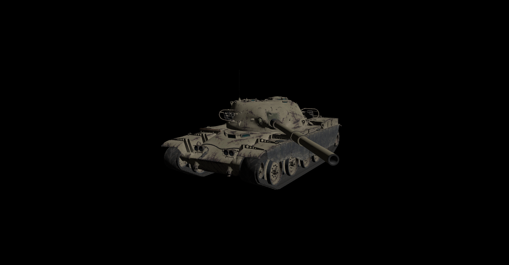
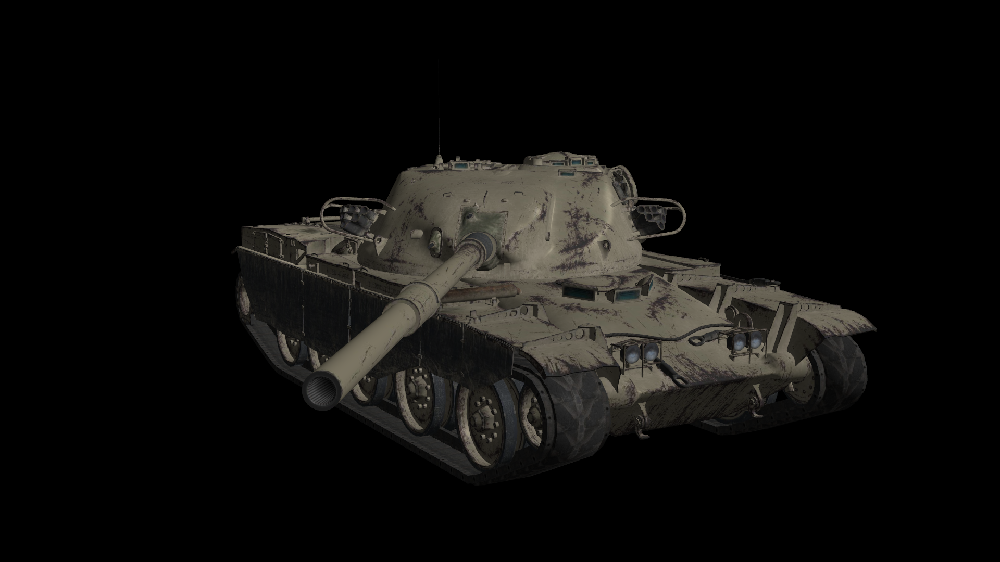
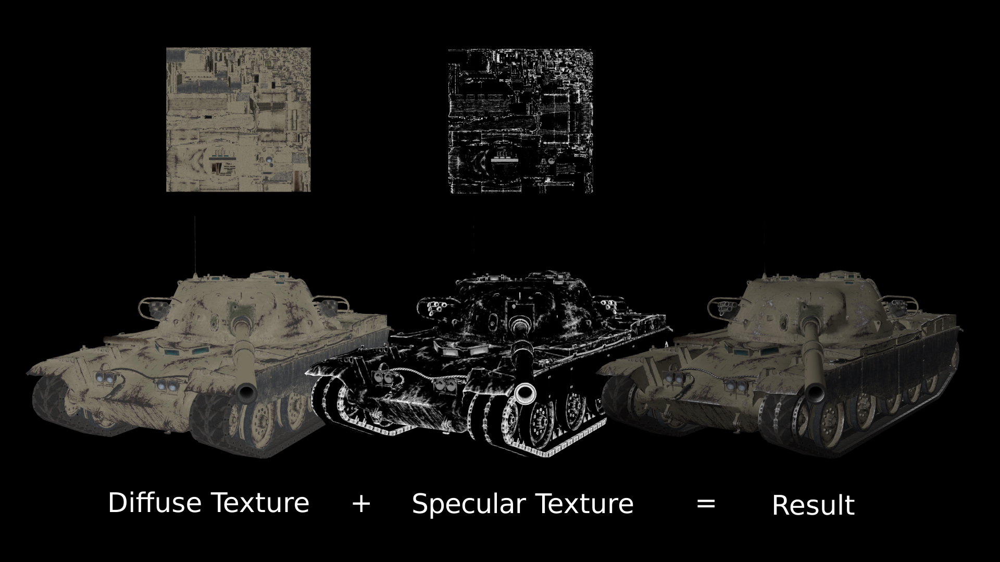
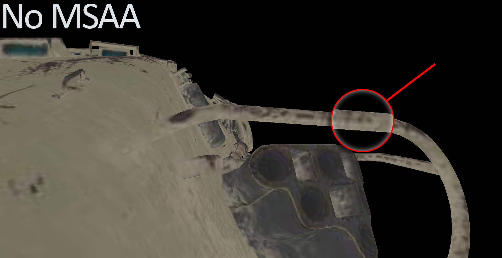
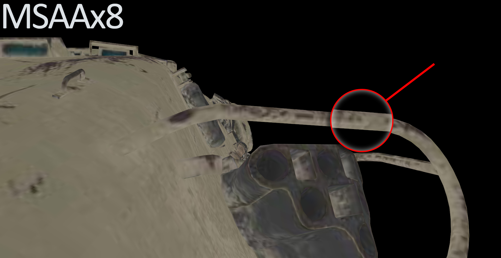
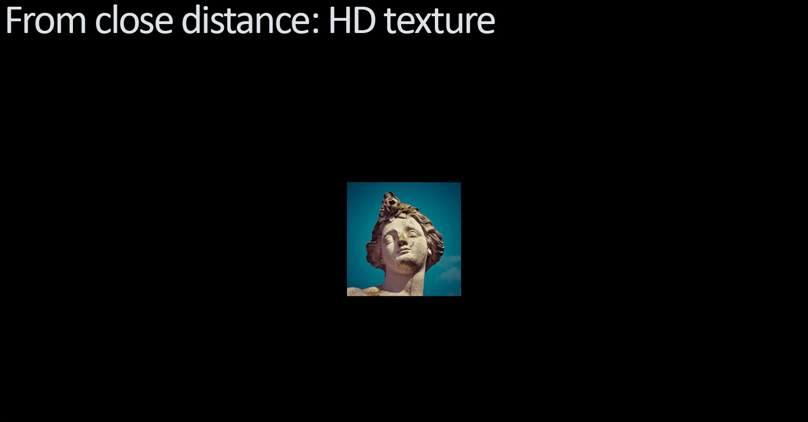
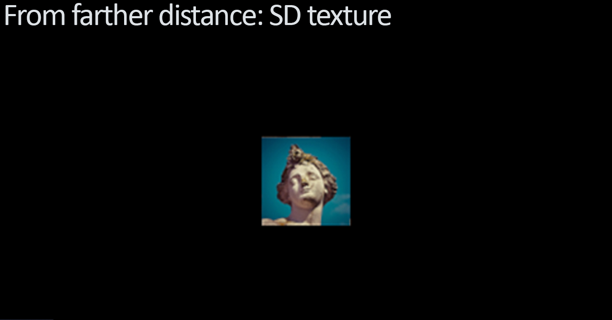
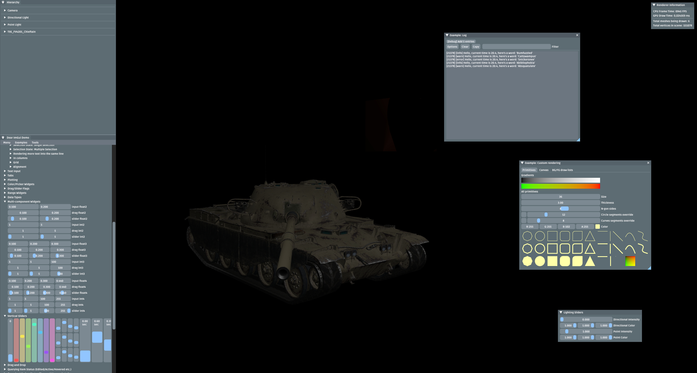

<h1 align="center">Sierra Engine</h1>
<h6 align="center">By: <a href="https://nikichatv.com/Website/N-Studios.html">Nikolay Kanchevski</a></h6>
<br>

<p>
A little <strong>open-source</strong> game engine, written in C# (.NET 6.0), which features some of the most common game programming techniques built-in. 
It is based on the <b><a href="https://www.vulkan.org/">Vulkan</a></b> rendering API, which provides support for 
<b>Windows 7-11</b>, <b>macOS</b>, <b>Linux</b>, <b>Android</b>, <b>iOS</b>, <b>tvOS</b> and other operating systems,
though the engine has only been tested on <b>Windows 10, 11</b> and <b>macOS Monterey</b>. All of its features are listed below.
</p>

<br>

## 🛠️ Building and Running the Engine

Clone the repository in your IDE of choice (<i>Visual Studio</i>, <i>Rider</i>, etc.) Now, you will have to run a Python script what will configure the project for you. Obviously, this will require your machine to have <b><a href="https://www.python.org/downloads/">Python 3</a></b> installed, so make sure you have that. Navigate over to the folder where you cloned the repo and run the following two commands in your command prompt or terminal:
```bat
$ cd Scripts/
$ python3 UpdateProject.py --Release
```

You can then proceed and run the program in your IDE. Make sure you are in <b>RELEASE</b> mode, because Debug mode will not be configured by the script. However, if you are feeling like working on the project yourself, feel free to change the <i>--Release</i> argument with <i>--Debug</i>, which will configure it for Debug mode.

<br>

## 🧭 Object Transformations

Every object has a field called <b>"transform"</b> and, you guessed it, it is capable of changing the <b>position</b>, <b>rotation</b>, and <b>scale</b> of each object in the 3D space. Here is an example on how to do just that:

```c#
someObject.transform.position = new Vector3(10.0f, 0.0f, -5.0f); // Changes the position in the world
someObject.transform.rotation = new Vector3(0.0f, 0.0f, 90.0f);  // Changes the rotation of the object
someObject.transform.scale = new Vector3(10.0f, 0.0f, -5.0f);    // Changes the scale of the object
```
<br>

You could, for example, put a tank in your world and make its turret rotate like so:

```c#
float upTimeSin = (float) Math.Sin(Time.upTime);    // The sine of the time since the program started
turretObject.transform.rotation = new Vector3(0.0f, upTimeSin * 45.0f, 0.0f);
gunObject.transform.rotation = new Vector3(0.0f, upTimeSin * 45.0f, 0.0f);
```
<br>

This is the result:


<br>

Hold on a second! Is that a custom 3D model?

<br>


## 🗿 Model Loader

That's right! How can a game engine be an engine and... not allow importing custom 3D models? In Sierra Engine it is as simple as:

```c#
MeshObject model = new MeshObject.LoadFromModel(FILE_NAME_HERE);
MeshObject model = new MeshObject.LoadFromModel("Models/Train.obj"); // <-- Example
```

<br>

## 🖼️ Texture System

Loading models is cool, but what is the point of it if they are not going to be colored, right? Well, when importing your model, the program automatically picks all textures applied to it and loads them into the renderer. Here is what the following code results in:

```c#
MeshObject model = MeshObject.LoadFromModel("Models/Chieftain/T95_FV4201_Chieftain.fbx");
```



<br>

## ☀️ Directional Lighting 

What is that? The tank's lower plate is very dark... strange, right? Nope, not at all.  There is <a href="https://en.wikipedia.org/wiki/Shading#Directional_lighting">Directional Lighting</a> implemented, which, combined with <a href="https://en.wikipedia.org/wiki/Phong_shading#Phong_reflection_model">Phong Shading</a>, allows for pretty accurate results. The lighting is calculated based on the normals of each mesh's vertices and acts as a light source, emitting rays at a single direction - pretty much like the sun does. Its intensity and color can be changed at any time. Shadows, however, are yet to come... but will be added, for sure!



However, our tank's light reflections do not look quite right... This is because we have not yet fully made use of the <b>Texture System</b>. We can use the model's specular maps to get a realistic result as shown:



<br>

## 👾 MSAA Anti-Aliasing

Because I doubt anyone likes pixelated images, there is a <a href="https://en.wikipedia.org/wiki/Multisample_anti-aliasing#:~:text=Multisample%20anti%2Daliasing%20(MSAA),computer%20graphics%20to%20remove%20jaggies.">MSAA</a> (Multisample Anti-Aliasing) system in place to get rid of all those pesky pixelelated fragments. Here is a comparison between <b>no MSAA</b> and <b>MSAAx8</b>:




<br>

## 🗺️ Mip Mapping

There is also <a href="https://en.wikipedia.org/wiki/Mipmap">Mip Mapping</a>, which, not only gets rid of <a href="https://en.wikipedia.org/wiki/Moir%C3%A9_pattern">Moiré patterns</a> in textures, but also greatly increases the frame rate. What it does is lower the quality of textures when the camera is far from the object. It is barely noticable to the user, but saves a lot of computing resources on textures. Here is an example:




<p style="opacity: 0.5">Note: the second picture is zoomed in a lot to show the effect. In reality, you cannot even see the quality being lowered due to how far the object is from you.</p>

<br>

## 🔘 User Interface

Seeing things drawn to our screen is great. But being able to interract with them is a whole new level of fun! With the help of the implemented UI system's elements (such as <i>sliders</i>, <i>buttons</i>, <i>trees</i>, <i>etc.</i>), the user is able to manipulate stuff in the game scene. Here is a simple demo of it:



The UI of the application will be extended greatly to provide easy access to the game engine's core. This is only a test of the system.

<br>

## 👍 Ease of Use

The program is packed with numerous useful classes. Let's say you wanted to maximize the window. This is how you would do it:

```c#
window.Maximize();
```
<br>

If you want to get the current position of the cursor over the window:
```c#
Vector2 cursorPosition = Cursor.cursorPosition;
```
<br>

And if you want to check whether a key on the keyboard is pressed:
```c#
bool spacePressed = Input.GetKeyPressed(Key.Space);
```
<br>

Wait, you want to detect the GPU model of the machine? Easy:
```c#
string gpuModel = SystemInformation.gpuModel;
```
<br>

There are many other similar utility classes that make the gathering of data within your game/program/app incredibly easy. All of this - in a single namespace:

```c#
using SierraEngine.Engine;
```

<br>

## 🏃 Performance

Graphics applications are usually very heavy and run slowly. Thankfully, this is not the case with Sierra Engine.
Despite all of its features, it still manages to do about <b>1,800</b> frames per second (FPS) and <b>2,000</b> GPU
draws per second on a system equipped with a <b>Ryzen 5 3600X</b> CPU
and a <b>NVIDIA GeForce GTX 1070 TI</b> GPU.

<br>

## 🆕 What's next?

There are many other features planned. Some of them are:

<p>

- [x] <a href="https://en.wikipedia.org/wiki/User_interface">UI</a>
- [x] <a href="https://en.wikipedia.org/wiki/Computer_graphics_lighting#Point">Point Lights</a>
- [x] Performance Monitoring
- [x] Vulkan Abstracting
- [ ] <a href="https://en.wikipedia.org/wiki/Shadow_mapping">Shadow Mapping</a>
- [ ] <a href="https://en.wikipedia.org/wiki/Video_post-processing">Post-Processing</a>
- [ ] <a href="https://en.wikipedia.org/wiki/Multithreading_(computer_architecture)">Multi-Threading 😥</a>
- [ ] Camera System

</p>

<br>

##  🤓️  About

<h4>Information on the project:</h4>
<br>
<p>
    Frameworks used: 
    <ul>
        <li><a href="https://www.vulkan.org/">Vulkan</a> - For both cross-platform and pefromant-friendly rendering.</li>
        <li><a href="https://github.com/glfw/glfw">GLFW</a> - For creating window interface and connecting it to the <b>Vulkan</b> renderer.</li>
        <li><a href="https://github.com/assimp/assimp">Assimp</a> - For the loading of all kinds of 3D model formats (.obj, .fbx, .dae, etc.).</li>
        <li><a href="https://github.com/nothings/stb">Stb</a> - For loading image data from all kinds of image formats (.jpg, .png, etc.).</li>
        <li><a href="https://github.com/ocornut/imgui">ImGui</a> - For the user interface implemented.</li>
        <li><a href="https://ih1.redbubble.net/image.528192883.5730/st,small,845x845-pad,1000x1000,f8f8f8.u9.jpg">My Brain</a> - There is not much left of it, actually...</li>
    </ul>
    <br>
    Software used: 
    <ul>
        <li><a href="https://www.jetbrains.com/rider/">JetBrains Rider</a> - A <b>cross-platform</b> IDE used to develop the .NET project on both my <b>macOS</b> and <b>Windows</b> systems.</li>
        <li><a href="https://www.blender.org/">Blender</a> - For the testing of 3D models and textures functionality.</li>
        <li><a href="https://trello.com/b/RMYtZPOg/sierra-engine">Trello</a> - For pretending to have an organized list of things to implement next.</li>
    </ul>
</p>

---------------------------------------------------------------------------------------------------------------------------------------------------------------------------

<p align="center" id="LinesCounter">Total lines of code: 7440</p>
<p align="center" id="LastUpdated">Last updated: 27/08/2022</p>

---------------------------------------------------------------------------------------------------------------------------------------------------------------------------